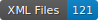

# HTR_Paul_corpus

   

# Table of Contents

[I. Guideline for Segmentation](#i-guideline-for-segmentation)  
[II. Guideline for Transcription](#ii-guideline-for-transcription)  
[ III. Encoding Problem](#iii-encoding-problem) 

# I. Guideline for Segmentation

The main documentation  is here: [Annotation Guide on GitHub](https://github.com/DEFI-COLaF/LADaS/blob/main/AnnotationGuide.md).

## Examples of Specific Cases in Our Corpus

### Ontology
- **RunningTitleZone** for the running header at the top of the page
- **GraphicZone** for all decorations (illustrations, ornamentation, etc)
- **MainZone:Head** for intermediate headings and biblical verses when they are emphasized by the layout
- **MainZone:P** for a paragraph
- **MainZone:Continued** for the continuation of an interrupted paragraph
- **NumberingZone** for numbering (pagination or foliation)
- **DropCapitalZone** for drop capitals at the beginning of a section
- **QuireMarkZone** or the organization of quires
- **MarginTextZone-Note** for marginal comments

### Examples

| Description | Example |
| -------- | ------- |
| **RunningTitleZone**: viola   **MainZone:Head**: orange   **MainZone:P**: yellow   **MainZone:Continued**: red   **NumberingZone**: light blue   **QuireMarkZone**: dark blue  **MarginTextZone-Note**: green |  |
| **RunningTitleZone**: pink   **DropCapitalZone**: dark viola   **MainZone:Head**: yellow   **MainZone:P**: dark green   **MainZone:Continued**: light blue   **NumberingZone**: rosa for "456", "II", "III"   **QuireMarkZone**: viola   **MarginTextZone-Note**: pink |  |
| **RunningTitleZone**: pink for "VII" (Epistle number) and "Col" (Epistle name)   **MainZone:Head**: yellow   **MainZone:P**: dark green   **MainZone:Continued**: light blue   **NumberingZone**: rosa for "7", "8", "184" |  |
| **RunningTitleZone**: pink for "COM"   **DropCapitalZone**: dark viola   **MainZone:Head**: yellow   **MainZone:P**: dark green   **MainZone:Continued**: light blue   **NumberingZone**: rosa for "1", "C4", "D4", "5", "6" |  |
| **RunningTitleZone**: red   **MainZone:Continued**: viola   **GraphicZone**rosa**   **MainZone:Head**: light green   **MainZone:P**: blue   **NumberingZone**: rosa   **QuireMarkZone**: rosa |  |
| **TitlePageZone**: light light viola   **MarginTextZone-ManuscriptAddendum**: red   _for the manuscript annotation around the text_   |  |

# II. Guideline for Transcription

We follow, as much as possible, the transcription standards proposed by [Catmus standard](https://catmus-guidelines.github.io):

**Citation:**

Ariane Pinche, Thibault Clérice, Alix Chagué, Jean-Baptiste Camps, Malamatenia Vlachou-Efstathiou, et al., *CATMuS-Medieval: Consistent Approaches to Transcribing ManuScripts: A generalized set of guidelines and models for Latin scripts from Middle Ages (8th–16th century)*. 2023. [hal-04346939](https://hal.archives-ouvertes.fr/hal-04346939).

## Special Cases

* Special cases are documented in the examples below. The relevant letters or signs are encoded in **Junicode** and added to the [_exegesis_ keyboard](keyboard/exegesis.json).
* Greek text is fully transcribed and edited without preserving any abbreviations or ligatures.
* Hebrew letters may appear in the data but are not corrected as of now (19.02.2025).

## Tools for Building the Transcription

* **Download the keyboard for special letters:** /
  - If a letter is not already included in the keyboard, take a screenshot and store the image in `pictures/mysteria_litterae`.
* **Greek Transcription:**
  - Greek is transcribed fully.
  - Issues related to transcribing ligatures can be resolved using:
    - [Greek_Abbreviations.pdf](Greek_Abbreviations.pdf)
    - [_Alphabetum Graecum_ by Theodore de Bèze](https://doi.org/10.3931/e-rara-6065), see vignettes 27-39.

## Examples of Special Cases

| **Sign**             | **Example**                                                                                          | **Source**                                  | **Transcription** | **Unicode/Junicode** |
|----------------------|-----------------------------------------------------------------------------------------------------|--------------------------------------------|-------------------|----------------|
| Pilcrow              |  | [e-rara, p.11](https://doi.org/10.3931/e-rara-6338) | ¶                 | `U+00B6` |
| Semicolon (shaped)   |  | |  | q `U+0071` + acute `U+0301`   Junicode (`F1AC`) |
| Cumque Abbreviation |  | |  | Junicode (`00E8BF`) + tilde (`000303`) |
| Tur Abbreviation  |  | |  | Junicode (`000303`) + t Unicode |

# III. Encoding Problem
Some characters in eScriptorium use the Junicode font, and a suitable interface is needed for reading them.

### Reading Hidden Characters in Junicode on eScriptorium

| Original state | Encoding Failure | Encoding Success |
|:----------------:|:-----------------:|:----------------:|
|  |   | |

---

### Steps to Resolve Encoding Issues with Stylus:

1. **Use Google Chrome:**  
   Ensure you are using Chrome as your web browser. The following steps require the Stylus extension.

2. **Download the Stylus Extension:**  
   Install Stylus from the Chrome Web Store:  
   [Stylus Extension](https://chromewebstore.google.com/detail/stylus/clngdbkpkpeebahjckkjfobafhncgmne)

3. **Upload the MUFI Style for eScriptorium:**  
   Download the MUFI style from this link:  
   [MUFI for eScriptorium](https://userstyles.world/style/3915/mufi-for-escriptorium)

4. **Implement and Apply the Style:**  
   - Open the Stylus extension in Chrome.  
   - Upload the downloaded MUFI style.  
   - Apply the style to the **e-Scriptorium** domain
---

  
  
     

