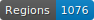

# HTR_Paul_corpus
A

   

# Guideline for Segmentation

The main documentation  is here: [Annotation Guide on GitHub](https://github.com/DEFI-COLaF/LADaS/blob/main/AnnotationGuide.md).

## Examples of Specific Cases in Our Corpus

### Legend
- **RunningTitleZone**: pink
- **MainZone:Head**: yellow
- **MainZone:P**: dark green
- **MainZone:P#Continued**: light blue
- **NumberingZone**: rosa (specific examples provided)
- **DropCapitalZone**: dark viola
- **QuireMarkZone**: viola

### 3. Examples

| Description | Example |
| -------- | ------- |
| **RunningTitleZone**: pink   **MainZone:Head**: yellow   **MainZone:P**: dark green   **MainZone:P#Continued**: light blue   **NumberingZone**: rosa for "section 12" and "102"   **QuireMarkZone**: viola |  |
| **RunningTitleZone**: pink   **DropCapitalZone**: dark viola   **MainZone:Head**: yellow   **MainZone:P**: dark green   **MainZone:P#Continued**: light blue   **NumberingZone**: rosa for "456", "II", "III"   **QuireMarkZone**: viola |  |
| **RunningTitleZone**: pink for "VII" (Epistle number) and "Col" (Epistle name)   **MainZone:Head**: yellow   **MainZone:P**: dark green   **MainZone:P#Continued**: light blue   **NumberingZone**: rosa for "7", "8", "184" |  |
| **RunningTitleZone**: pink for "COM"   **DropCapitalZone**: dark viola   **MainZone:Head**: yellow   **MainZone:P**: dark green   **MainZone:P#Continued**: light blue   **NumberingZone**: rosa for "1", "C4", "D4", "5", "6" |  |
| **RunningTitleZone**: viola   **MainZone-ListItem**:green   **MainZone:Head**: red   **MainZone:P**: orange   **NumberingZone**: blue   **QuireMarkZone**: dark blue |  |
| **TitlePageZone**: light viola   **MarginTextZone-ManuscriptAddendum**: red   _for the manuscript annotation around the text_   |  |

# Guideline for Transcription

| **Sign**             | **Example**                                                                                          | **Source**                                  | **Transcription** | **Unicode/Junicode** |
|----------------------|-----------------------------------------------------------------------------------------------------|--------------------------------------------|-------------------|-------------|
| Pilcrow              |  | [e-rara, p.11](https://doi.org/10.3931/e-rara-6338) | ¶                 |     `U+00B6`        |
| Semicolon (shaped)   |  |                                       |                | q `U+0071` + acute `U+0301`    `Junicode (F1AC)`             |
|cumque abreviation |  | |  | Junicode (00E8BF)+tilde (000303)|
|tur abreviation  |  || | Junicode(000303)  + t unicode|

# Encoding Problem
Some characters in eScriptorium use the Junicode font, and a suitable interface is needed for reading them.

### Reading Hidden Characters in Junicode on eScriptorium

| Original state | Encoding Failure | Encoding Success |
|:----------------:|:-----------------:|:----------------:|
|  |   | |

---

### Steps to Resolve Encoding Issues with Stylus:

1. **Use Google Chrome:**  
   Ensure you are using Chrome as your web browser. The following steps require the Stylus extension.

2. **Download the Stylus Extension:**  
   Install Stylus from the Chrome Web Store:  
   [Stylus Extension](https://chromewebstore.google.com/detail/stylus/clngdbkpkpeebahjckkjfobafhncgmne)

3. **Upload the MUFI Style for eScriptorium:**  
   Download the MUFI style from this link:  
   [MUFI for eScriptorium](https://userstyles.world/style/3915/mufi-for-escriptorium)

4. **Implement and Apply the Style:**  
   - Open the Stylus extension in Chrome.  
   - Upload the downloaded MUFI style.  
   - Apply the style to the **e-Scriptorium** domain
---

  
  
     

